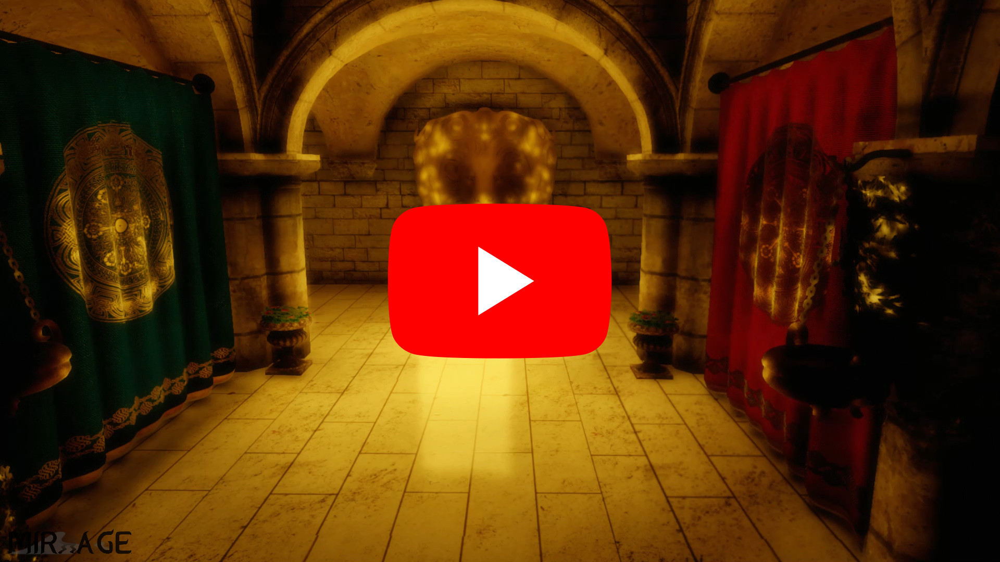
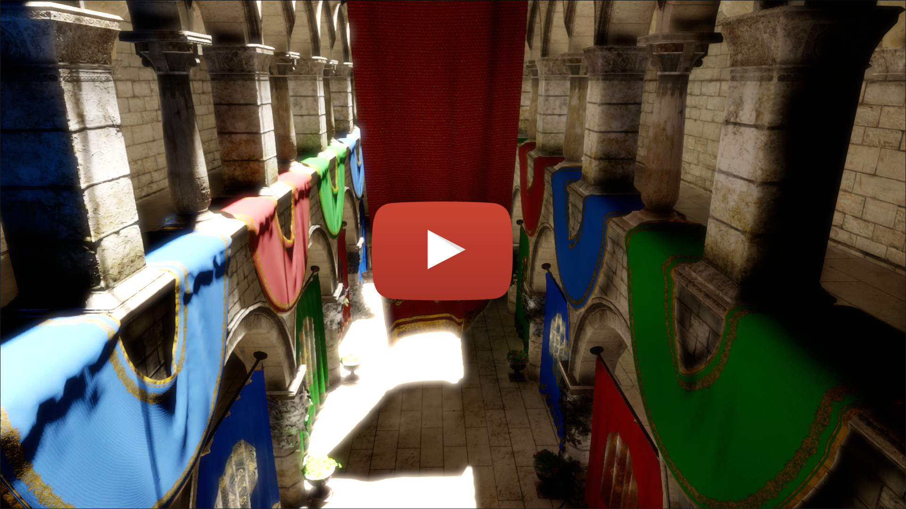
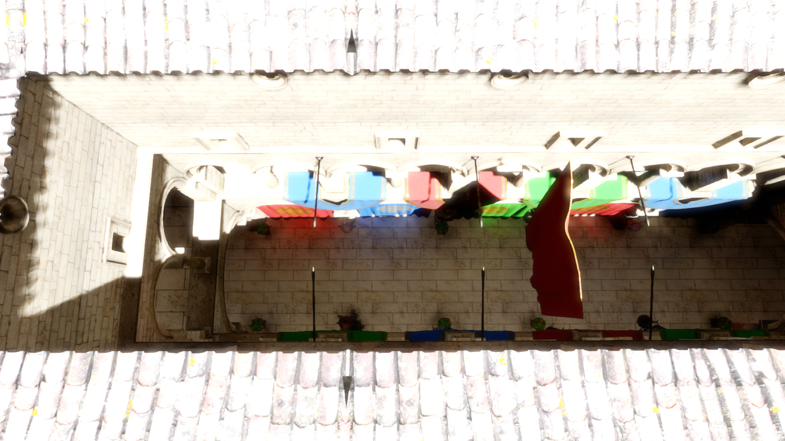
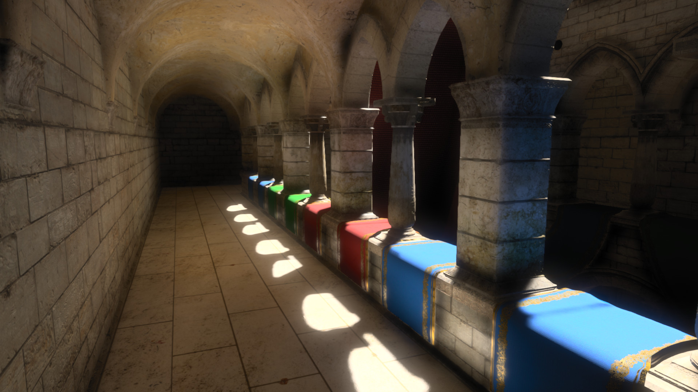
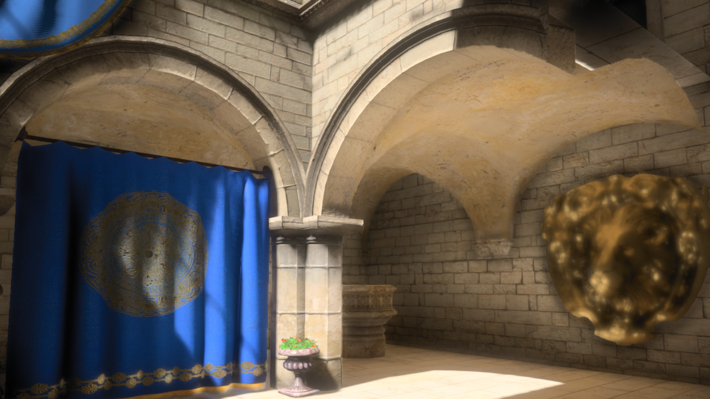
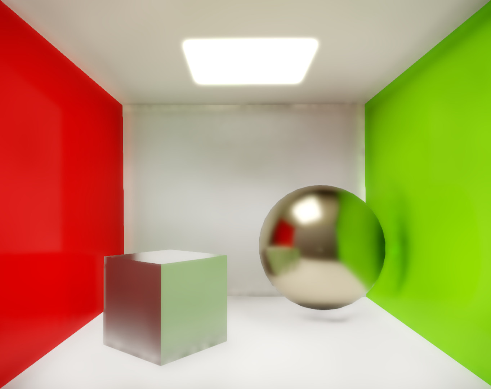
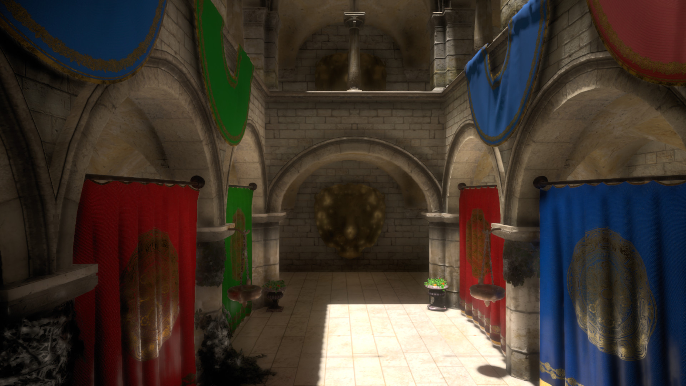
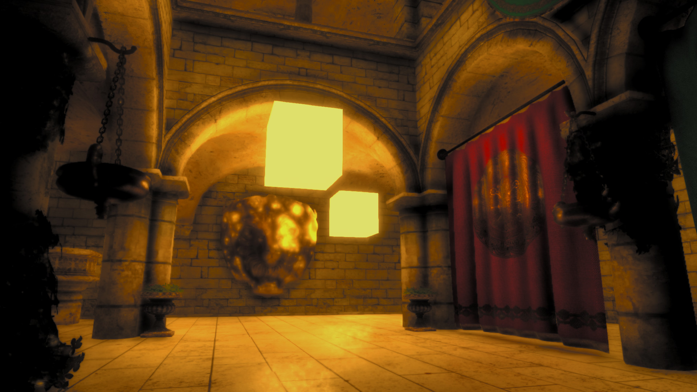

## Mirrage

Mirrage (Mirrage Indirect Radiance Renderer And Game Engine) is a Vulkan based deferred renderer with bits and pieces of a simple game engine, that has been developed as part of my CS Bachelor thesis about screen-space global illumination. As such it is (at least in its current state) mostly just a fancy renderer with a simple demo application and just enough engine stuff (ECS, input, ui, glue-code) to keep that running. But in the future I will hopefully get it to an actually usefull state and use it as a basis for my future projects.

### Demo

|  |  |
|------------------|------------------|
|  |  |
|  |  |

### Dependencies
Required:
- CMake >= 3.8
- SDL2 >= 2.0.7
- Vulkan + Vulkan-HPP >= 1.1.70
- GLSLC (if MIRRAGE_COMPILE_SHADERS is ON)

Included in this repository:
- Assimp 3.3.1 (only for mesh-converter)
- glm
- gsl
- moodycamel
- nuklear
- physicsFS
- SF2
- stb_image (only for mesh-converter)

### Supported Compilers
- GCC >= 7
- Clang >= 5

### Build from Source
- git clone https://github.com/lowkey42/mirrage.git
- mkdir mirrage_build
- cd mirrage_build
- cmake ../mirrage
- cmake --build .

In order to execute the compiled demo application, the src/demo/demo binary has be be executed from the working directory assets (the folder containing the archives.lst) and this folder has to contain the required models (Sponza and Conrnell-Box) in its extensions sub-directory. This assets can be downloaded from the latetest release.

The project can be further configured by setting the following CMake-Properties (-DPROP=ON/OFF):
- MIRRAGE_BUILD_MESH_CONVERTER: Also build the mesh converter that can be used to converter models into the engine specific data format (Default: OFF)
- MIRRAGE_COMPILE_SHADERS: Also compile the glsl shaders into SPIR-V (requires GLSLC)
- MIRRAGE_ENABLE_CLANG_FORMAT: Includes an additional clangformat target, that can be used to automatically format all source files in the project
- MIRRAGE_ENABLE_LTO: Activates link time optimizations on gcc/clang (Default: OFF)
- MIRRAGE_SAN: Build with clang sanatizers (address, integer, undefined and address-use-after-scope) (Default: OFF)
- MIRRAGE_USE_LIBCPP: Uses libc++ instead of libstdc++ when compiling with clang (Default: ON)

